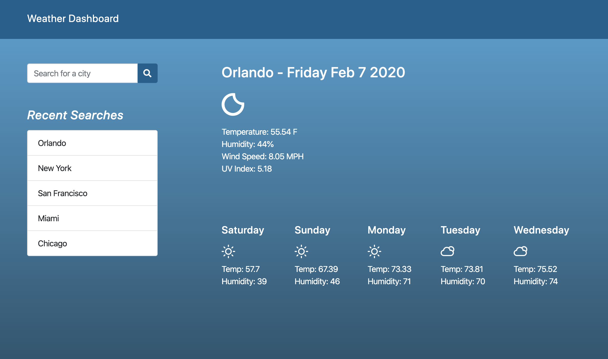

# Weather Dashboard / [Demo](https://yarocruz.github.io/weather-dashboard/) 



## Description

This is a web application that uses [OpenWeatherMap's](https://openweathermap.org/) API. When the user types in a city name, he can hit enter or click the input search button and see the city's current weather. It specifically grabs the temperature, humidity, wind speed, and UV index. It also gives you a 5 day forecasts. It also saves the last five city searches. 

## Technologies

This project uses [jQuery](https://jquery.com/), [Bootsrap](https://getbootstrap.com/) and for the icons I found these sweet open source weather icons at [here](https://github.com/erikflowers/weather-icons). Making requests with jQuery's .ajax() made it a breeze to make requests. 

## Problems / Solutions

Getting the five day forecast was the most difficult part of this project. First, you have to make a separate call and what you get from it is 40 objects with future weather data in 3 hour increments. I knew I had to do a conditional loop, but I had no idea at first how I was going to make sure it selected 5 different days. The line that does the magic is below.

``` js
if (res.list[i].dt_txt.indexOf("15:00:00") !== -1)
```

## Demo

See live demo [here](https://yarocruz.github.io/weather-dashboard/)

## License 

[MIT](/LICENSE)

Feel free to clone this repo and modify as you wish.
